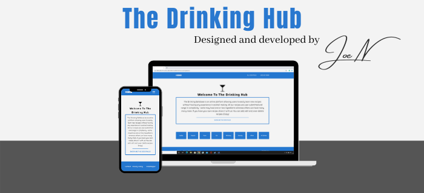

<h1 align="center">The Drinking Hub</h1>

The Drinking Hub is a drinking database for users to discover recipes for cocktails. Not only will visitors be able to browse recipes for drinks, but also share their own.
  
<h2 align="center"></h2>
<h2 align="center"><a href="#">Click HERE For The Live Site</a></h2>

## User Experience (UX)

- ### User stories
    - #### First Time Visitor Goals
        1. As a First Time Visitor, I want to easily find recipes for the drinks I like.
        2. Also, I want to find the ingredients and method for making the cocktail.
        4. Also, I want to easily post my recipe ideas and showcase them to other users.
        3. Also, I want to easily navigate through the site and always have a way of moving to another section.

    - #### Returning Visitor Goals
        1. As a Returning Visitor, I want to see new recipes that I can try.
        2. Also, I want to easily edit or remove my own recipes depending on popularity.

    - #### Frequent User Goals
        1. As a Frequent User, I want to easily contact the admins of the site if I see any issues or bugs.
        2. Also, I want to see continual growth of the database and more recipes.

